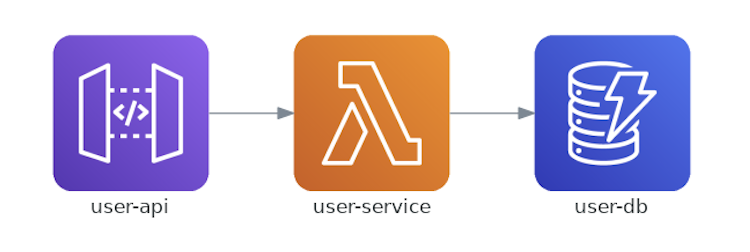

# This project is to show how to use Klotho to quickly create a cloud-ready REST API with data persistence.
- [Klotho doc](https://klo.dev/docs/)
- [Klotho Github repo](https://github.com/klothoplatform/klotho)


## Run the app locally

- run your REST API application :
```shell
npm install
node index.js
> App listening locally on: 3000
```

- test User API
```shell
# list users
http :3000/users

# create a user
http POST :3000/users name=rich email=rich@gmail.com
```

## Compiling with Klotho
- compile the application for AWS
```
klotho . --app klotho-rest-api --provider aws
```

```
549 rich:klotho-rest-api $ klotho . --app klotho-rest-api --provider aws
██╗  ██╗██╗      ██████╗ ████████╗██╗  ██╗ ██████╗
██║ ██╔╝██║     ██╔═══██╗╚══██╔══╝██║  ██║██╔═══██╗
█████╔╝ ██║     ██║   ██║   ██║   ███████║██║   ██║
██╔═██╗ ██║     ██║   ██║   ██║   ██╔══██║██║   ██║
██║  ██╗███████╗╚██████╔╝   ██║   ██║  ██║╚██████╔╝
╚═╝  ╚═╝╚══════╝ ╚═════╝    ╚═╝   ╚═╝  ╚═╝ ╚═════╝
Adding resource input_file_dependencies:
Adding resource exec_unit:user-service
Found 2 route(s) on server 'app'                                                                                                      unit: user-service
Adding resource gateway:user-api
Adding resource persist_kv:user-db
Adding resource topology:klotho-rest-api
Adding resource aws_template_data:klotho-rest-api
Adding resource infra_as_code:Pulumi (AWS)
Pulumi.klotho-rest-api.yaml: Make sure to run `pulumi config set aws:region YOUR_REGION --cwd 'compiled/' -s 'klotho-rest-api'` to configure the target AWS region.
```

### compiled output
- **compiled/klotho-rest-api.png**: Klotho generates a high-level topology diagram showing the cloud resources

- **compiled/klotho.yaml**: Klotho's configuration file, which analyzes annotation and generates corresponding cloud resources

- **compiled/index.ts**: Klotho generates Pulumi program that defines your stack resources.

## Deploying 

Deployment dependencies:
- Docker 
- AWS account
- Pulumi CLI

- set the pulumi region configuration:
```
pulumi config set aws:region <region> --cwd 'compiled/' -s ts-sg
```

- install the project dependencies and deploy.
```
cd compiled
npm install
pulumi up
```

```
Updating (aws-dev):
     Type                                    Name                                 Status              Info
     pulumi:pulumi:Stack                     klotho-rest-api-aws-dev                                  2 messages
     ├─ awsx:ecr:Repository                  klotho-rest-api
 +   ├─ aws:lambda:Function                  user-service                         created (20s)
 +   │  ├─ aws:lambda:Permission             user-service-get-/users-permission   created (0.29s)
 +   │  └─ aws:lambda:Permission             user-service-post-/users-permission  created (0.45s)
     ├─ aws:apigateway:RestApi               user-api
     │  ├─ aws:apigateway:Resource           user-apiusers/
     │  │  ├─ aws:apigateway:Method          POST-users-954da
 +   │  │  │  └─ aws:apigateway:Integration  lambda-POST-users-954da              created (0.42s)
     │  │  └─ aws:apigateway:Method          GET-users-954da
 +   │  │     └─ aws:apigateway:Integration  lambda-GET-users-954da               created (0.43s)
 +   │  └─ aws:apigateway:Deployment         user-api-deployment                  created (0.32s)
 +   │     └─ aws:apigateway:Stage           user-api-stage                       created (0.35s)
     └─ aws:iam:Role                         klotho-rest-api_32ca3_LambdaExec
 +      ├─ aws:iam:Policy                    klotho-rest-api-user-service-exec    created (1s)
 +      └─ aws:iam:RolePolicyAttachment      klotho-rest-api-user-service-exec    created (0.50s)
```

## Change the Klotho configuration (Execution Unit)

- update the type field in execution_units from lambda to fargate
```yaml
execution_units:
    user-service:
        type: lambda  # type: ecs
        network_placement: private
        pulumi_params:
            memorySize: 512
            timeout: 180
```


